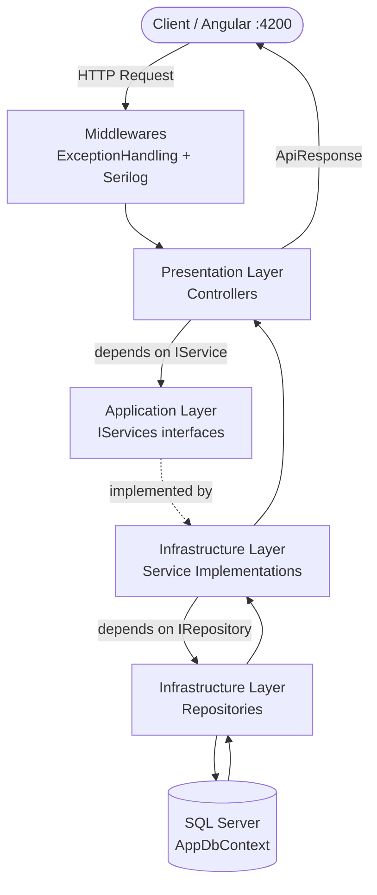
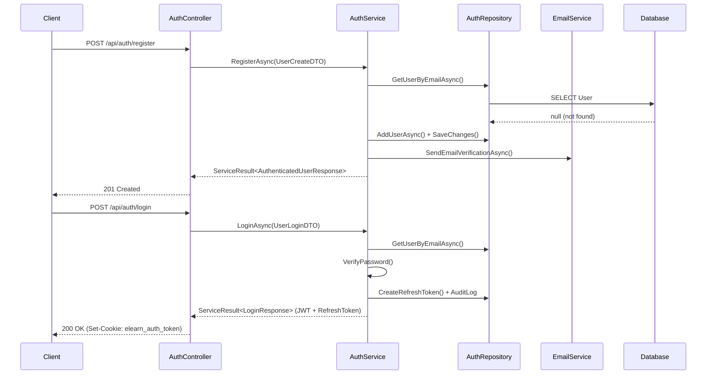
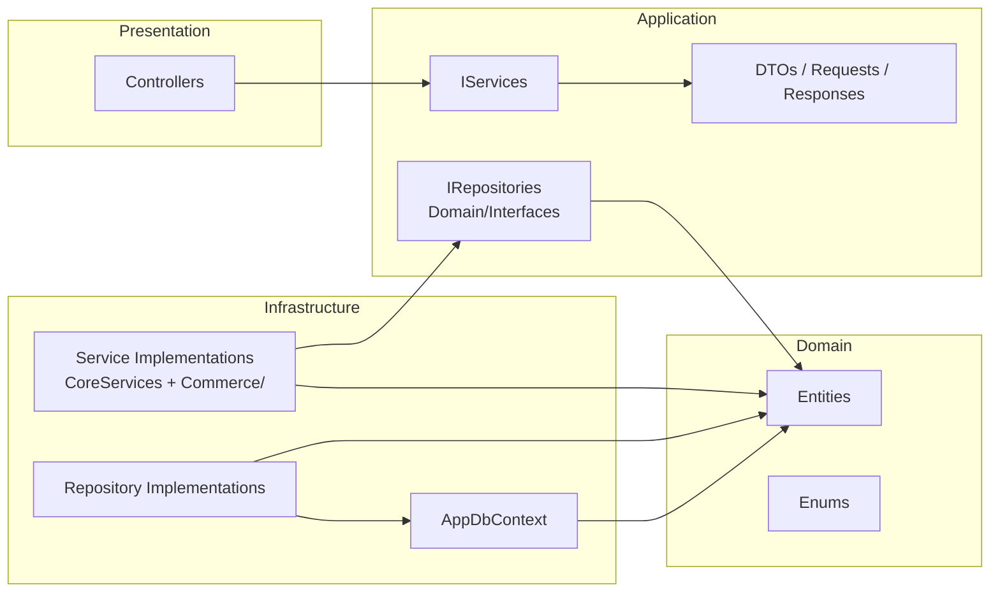

# Kiến trúc Dự án elearn-server

## 1. Tổng quan Luồng Request



---

## 2. Clean Architecture Layers

```
elearn-server/
├── Program.cs                        ← Entry point, DI container, Middleware pipeline
├── Common/Options/                   ← Config options (JwtOptions, AuthSecurityOptions, OllamaOptions)
└── src/
    ├── Domain/                       ← Lõi nghiệp vụ, không phụ thuộc gì
    ├── Application/                  ← Interfaces & DTOs, phụ thuộc Domain
    ├── Infrastructure/               ← Triển khai thực tế (DB, Services)
    ├── Presentation/                 ← Controllers (HTTP layer)
    ├── Middlewares/                  ← Cross-cutting concerns
    └── Validators/                   ← (Rỗng - chưa dùng)
```

---

## 3. Domain Layer — `src/Domain/`

### Entities (26 files)
| File | Vai trò |
|------|---------|
| `BaseEntity.cs` | Base class chứa `CreatedAt`, `UpdatedAt`, `UpdatedBy` (inheritance) |
| `User.cs` | Người dùng hệ thống |
| `Role.cs` | Vai trò (Admin, Instructor, Student) |
| `Course.cs` | Khóa học |
| `Category.cs` | Danh mục khóa học |
| `Lesson.cs` | Bài học trong Section |
| `Section.cs` *(CourseAggregate)* | Chương/phần của khóa học |
| `LearningOutcome.cs` *(CourseAggregate)* | Mục tiêu học tập của khóa học |
| `CourseRequirement.cs` *(CourseAggregate)* | Yêu cầu đầu vào khóa học |
| `CourseTargetAudience.cs` *(CourseAggregate)* | Đối tượng mục tiêu khóa học |
| `Order.cs` | Đơn hàng |
| `OrderDetail.cs` | Chi tiết đơn hàng |
| `Cart.cs` + `CartItem.cs` | Giỏ hàng |
| `Wishlist.cs` | Danh sách yêu thích |
| `Payment.cs` | Thanh toán |
| `Enrollment.cs` | Đăng ký khóa học |
| `Comment.cs` | Bình luận |
| `Certificate.cs` | Chứng chỉ |
| `Rating.cs` | Đánh giá khóa học |
| `Notification.cs` | Thông báo hệ thống |
| `RefreshToken.cs` | JWT Refresh Token |
| `BlacklistedToken.cs` | Token đã logout (blacklist) |
| `EmailVerificationToken.cs` | Token xác minh email |
| `PasswordResetToken.cs` | Token đặt lại mật khẩu |
| `AuditLog.cs` | Log hành động (login, logout, ...) |
| `StatusOrder.cs` | Entity trạng thái đơn hàng |
| `Assignment.cs` + `Quiz.cs` | Bài tập & Quiz (có entity nhưng **chưa được dùng trong service**) |
| `ErrorViewModel.cs` | ⚠️ Model lỗi MVC cũ — **không dùng trong API** |

### Interfaces (14 files) — Repository contracts
| Interface | Được implement bởi |
|-----------|-------------------|
| `IAuthRepository` | `AuthRepository.cs` |
| `IUserRepository` | `UserRepository.cs` |
| `ICategoryRepository` | `CategoryRepository.cs` |
| `ICourseRepository` | `CourseRepository.cs` |
| `IOrderRepository` | `OrderRepository.cs` |
| `IOrderDetailRepository` | `OrderDetailRepository.cs` |
| `ICartRepository` | `CartRepository.cs` |
| `IWishlistRepository` | `WishlistRepository.cs` |
| `IPaymentRepository` | `PaymentRepository.cs` |
| `IEnrollmentRepository` | `EnrollmentRepository.cs` |
| `ICommentRepository` | `CommentRepository.cs` |
| `ICertificateRepository` | `CertificateRepository.cs` |
| `IEmailService` | `EmailService.cs` |
| `ICourseRecommendationService` | `CourseRecommendationService.cs` |

### Enums (4 files)
`CourseStatus`, `LessonType`, `OrderStatus`, `PaymentStatus`

---

## 4. Application Layer — `src/Application/`

| File/Folder | Vai trò |
|-------------|---------|
| `Interfaces/IServices.cs` | **1 file duy nhất** định nghĩa tất cả 12 service interfaces: `IAuthService`, `IUserService`, `ICategoryService`, `ICourseService`, `IOrderService`, `IOrderDetailService`, `ICartService`, `IWishlistService`, `IPaymentService`, `IEnrollmentService`, `ICommentService`, `ICertificateService` |
| `Common/ApiResponse.cs` | Wrapper chuẩn cho HTTP response |
| `Common/ServiceResult.cs` | Result pattern dùng trong service layer |
| `DTOs/` | Data Transfer Objects cho input (UserCreateDTO, UserLoginDTO, CartDTO, ...) |
| `DTOs/Validation/StrongPasswordAttribute.cs` | Custom validation attribute cho password |
| `Requests/SharedRequests.cs` | Tập hợp tất cả request models (CreateRequest, UpdateRequest, ...) |
| `Requests/*.cs` | Các request model riêng lẻ: Order, Cart, OrderDetail, Recommendation |
| `Responses/SharedResponses.cs` | Tập hợp tất cả response models |
| `Mappings/EntityMappings.cs` | Extension methods mapping Entity → Response DTO |

---

## 5. Infrastructure Layer — `src/Infrastructure/`

### 5a. Persistence — `Persistence/`
| File | Vai trò |
|------|---------|
| `AppDbContext.cs` | EF Core DbContext, cấu hình tất cả DbSet, constraints, seed data |
| `Repositories/*.cs` | 12 repository implementations (CRUD + custom queries) |

### 5b. Services — `Services/`

> [!CAUTION]
> **VẤN ĐỀ TRÙNG LẶP NGHIÊM TRỌNG** — Đây là vùng có file bị trùng lặp chức năng.

#### ✅ Các Service được ĐĂNG KÝ và DÙNG (qua Program.cs)

| Service Class | File nguồn | Được đăng ký |
|--------------|-----------|-------------|
| `AuthService` | `CoreServices.cs` (line 23) | ✅ `AddScoped<IAuthService, AuthService>` |
| `UserService` | `CoreServices.cs` (line 401) | ✅ `AddScoped<IUserService, UserService>` |
| `CategoryService` | `CoreServices.cs` (line 492) | ✅ `AddScoped<ICategoryService, CategoryService>` |
| `CourseService` | `CoreServices.cs` (line 555) | ✅ `AddScoped<ICourseService, CourseService>` |
| `OrderService` | `Commerce/Orders/OrderService.cs` | ✅ `AddScoped<IOrderService, OrderService>` |
| `OrderDetailService` | `Commerce/Orders/OrderDetailService.cs` | ✅ `AddScoped<IOrderDetailService, OrderDetailService>` |
| `CartService` | `Commerce/Cart/CartService.cs` | ✅ `AddScoped<ICartService, CartService>` |
| `WishlistService` | `Commerce/Wishlist/WishlistService.cs` | ✅ `AddScoped<IWishlistService, WishlistService>` |
| `PaymentService` | `Commerce/Payment/PaymentService.cs` | ✅ `AddScoped<IPaymentService, PaymentService>` |
| `EnrollmentService` | `Commerce/Enrollment/EnrollmentService.cs` | ✅ `AddScoped<IEnrollmentService, EnrollmentService>` |
| `CommentService` | `Commerce/Comment/CommentService.cs` | ✅ `AddScoped<ICommentService, CommentService>` |
| `CertificateService` | `Commerce/Certificate/CertificateService.cs` | ✅ `AddScoped<ICertificateService, CertificateService>` |
| `EmailService` | `EmailService.cs` | ✅ |
| `FileStorageService` | `FileStorageService.cs` | ✅ |
| `CourseRecommendationService` | `CourseRecommendationService.cs` | ✅ |

#### ❌ File/Folder CÓ CODE nhưng KHÔNG ĐƯỢC DÙNG

| File/Path | Vấn đề |
|-----------|--------|
| `CoreServices.cs` (phần Commerce: line ~800-1100+) | Các class `OrderService`, `CartService`, ... trong `CoreServices.cs` đã bị **thay thế bởi các file trong `Commerce/`** nhưng file cũ vẫn còn đó |
| `Services/Core/Auth/` | **Thư mục rỗng** — được tạo ra khi refactor nhưng chưa có file nào |

---

## 6. Presentation Layer — `src/Presentation/Controllers/`

| Controller | Route | Service phụ thuộc |
|------------|-------|------------------|
| `ApiControllerBase.cs` | — | Base class chung |
| `AuthController.cs` | `/api/auth` | `IAuthService` |
| `UserController.cs` | `/api/users` | `IUserService` |
| `CategoryController.cs` | `/api/categories` | `ICategoryService` |
| `CourseController.cs` | `/api/courses` | `ICourseService` |
| `OrderController.cs` | `/api/orders` | `IOrderService` |
| `OrderdetailController.cs` | `/api/order-details` | `IOrderDetailService` |
| `CartController.cs` | `/api/cart` | `ICartService` |
| `WishlistController.cs` | `/api/wishlist` | `IWishlistService` |
| `PaymentController.cs` | `/api/payments` | `IPaymentService` |
| `EnrollmentController.cs` | `/api/enrollments` | `IEnrollmentService` |
| `CommentController.cs` | `/api/comments` | `ICommentService` |
| `CertificateController.cs` | `/api/certificates` | `ICertificateService` |
| `RecommendationController.cs` | `/api/recommendations` | `ICourseRecommendationService` |

---

## 7. Cross-cutting Concerns

| File | Vai trò |
|------|---------|
| `Middlewares/ExceptionHandlingMiddleware.cs` | Bắt exception toàn cục, trả về lỗi chuẩn |
| `Validators/` | **Thư mục rỗng** — FluentValidation validators chưa được tạo |
| `Common/Options/AuthOptions.cs` | Config: JWT, AuthSecurity settings |
| `Common/Options/OllamaOptions.cs` | Config: Ollama AI (dùng cho Recommendation) |

---

## 8. Files có vấn đề / Không cần thiết

> [!WARNING]
> Các file này nên được xem xét và dọn dẹp

| File | Vấn đề | Hành động đề xuất |
|------|--------|--------------------|
| `CoreServices.cs` | **1103 dòng monolith** chứa AuthService, UserService, CategoryService, CourseService. Commerce services đã được tách ra riêng nhưng file gốc vẫn còn | Tách Auth/User/Category/CourseService ra file riêng trong `Core/Auth/`, `Core/User/`, etc. rồi xóa `CoreServices.cs` |
| `Services/Core/Auth/` | Thư mục rỗng, không có file nào | Tạo `AuthService.cs` vào đây hoặc xóa |
| `Validators/` | Thư mục rỗng | Tạo validators hoặc xóa |
| `Domain/Entities/ErrorViewModel.cs` | File từ MVC template cũ, không liên quan API | Xóa |
| `Domain/Entities/Assignment.cs` + `Quiz.cs` | Có entity nhưng không có repository, service, hay controller nào dùng | Xóa hoặc implement đầy đủ |
| `Domain/Entities/Rating.cs` + `Notification.cs` | Tương tự - có entity nhưng không có service/controller | Xóa hoặc implement |
| `Domain/Entities/StatusOrder.cs` | Đã có enum `OrderStatus` — có thể trùng chức năng | Kiểm tra và xóa nếu không dùng |
| `old_json.json` | File tạm, không có mục đích rõ ràng | Xóa |
| `elearn-server.http` | File test HTTP cho VS Code — giữ lại nếu muốn test nhanh | Tùy chọn |

---

## 9. Luồng Auth Chi tiết



---

## 10. Sơ đồ phụ thuộc (Dependency Flow)


